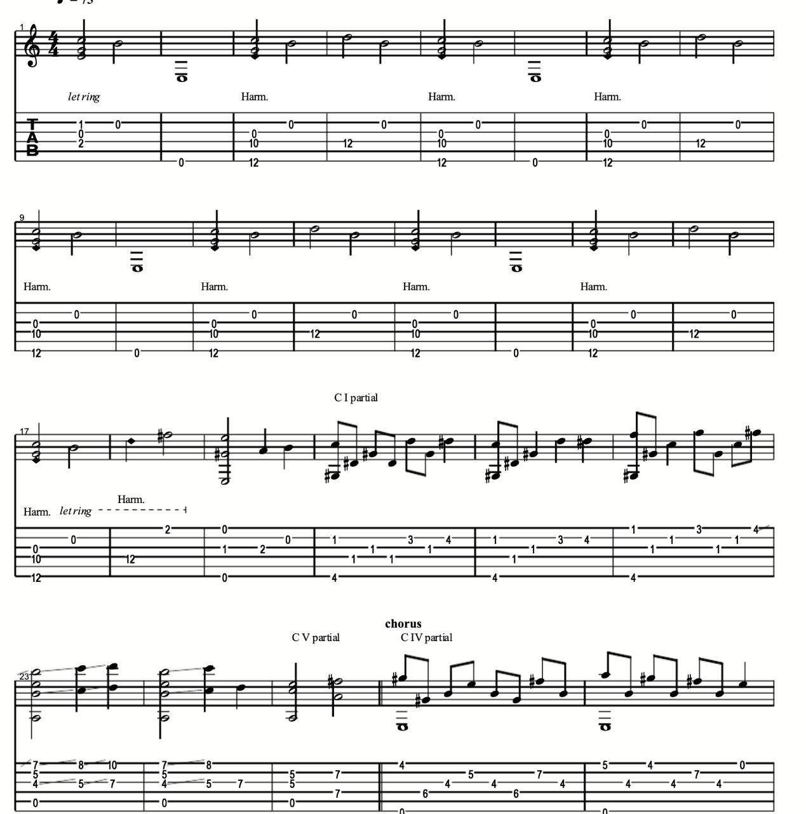
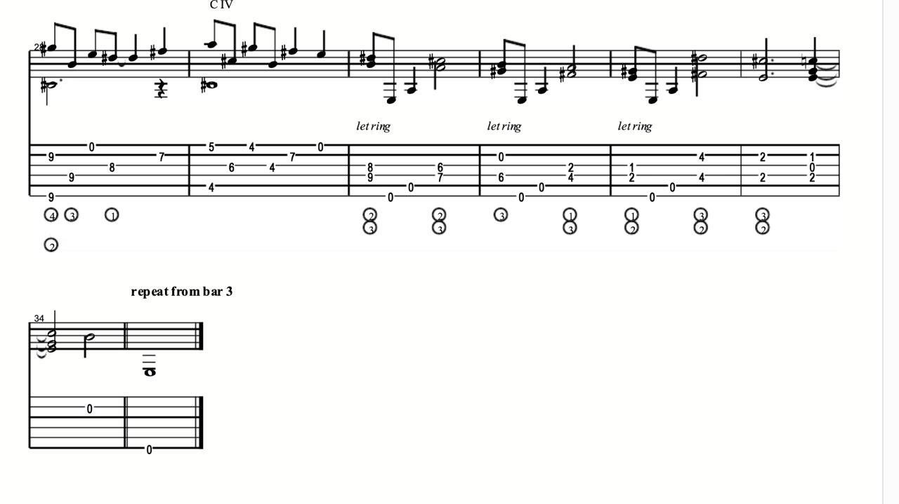

- Images:
	- 
	- 
- Examples:
	- [YouTube: Laura Palmer's Theme](https://www.youtube.com/watch?v=e-eqgr_gn4k)
- Part of:
	- [[Angelo Badalamenti (1937–2022)]]
- TODO:
	- Add musical context.
	- Add analysis and listening focus.
	- Add sources, examples, or performance notes.
